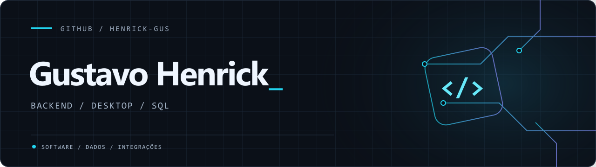

  

  <a href="https://gustavohenrick.com/"><strong>Portfólio</strong></a> &nbsp; / &nbsp;
  <a href="https://www.linkedin.com/in/henrick-gus/"><strong>LinkedIn</strong></a> &nbsp; / &nbsp;
  <a href="https://gustavohenrick.com/delphi-sql-graphs"><strong>Estudo técnico</strong></a>

### Olá, sou o Gustavo Henrick Reis.

Desenvolvedor de software com foco em **sistemas corporativos, aplicações desktop e bancos de dados**. Trabalho com Delphi e SQL na construção e manutenção de aplicações, integração de sistemas e automação de processos.

Gosto de investigar sistemas legados, entender gargalos e simplificar o que ficou complexo. Para mim, software bem construído precisa ser estável, eficiente e fácil de manter.

### No que trabalho

- **Desktop:** aplicações corporativas com Delphi / Object Pascal.
- **Dados:** Firebird SQL, stored procedures, triggers e consultas recursivas com CTEs.
- **Integrações:** APIs REST, automação de rotinas e migração de dados.
- **Em evolução:** Python para backend, APIs e análise de dados.

### Tecnologias

| Foco | Ferramentas e tecnologias |
| :--- | :--- |
| Base principal | Delphi · Object Pascal · Firebird SQL |
| Bancos de dados | Firebird · PostgreSQL · SQLite |
| Ecossistema desktop | FireDAC · FastReport |
| Desenvolvimento | Git · GitHub · VS Code |
| Aprofundando | Python |

### Um problema que explorei

**[Delphi + SQL: otimizando a navegação em grafos →](https://gustavohenrick.com/delphi-sql-graphs)**

Um estudo sobre consultas N+1 na navegação de registros hierárquicos, usando CTEs recursivas e integração assíncrona com Delphi para reduzir acessos ao banco e manter a interface responsiva.

---

Conheça mais sobre meu trabalho: **[LinkedIn](https://www.linkedin.com/in/henrick-gus/)** · **[Portfólio](https://gustavohenrick.com/)**.
